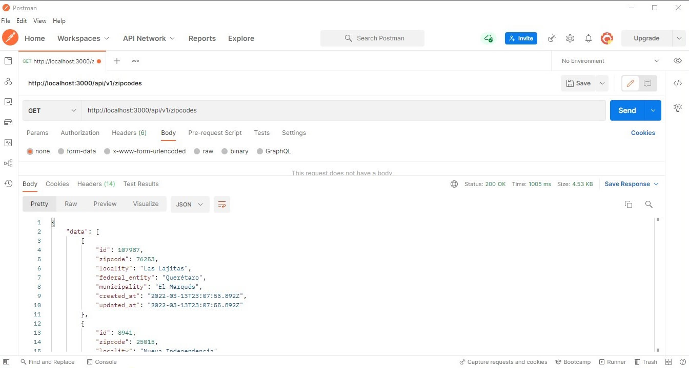
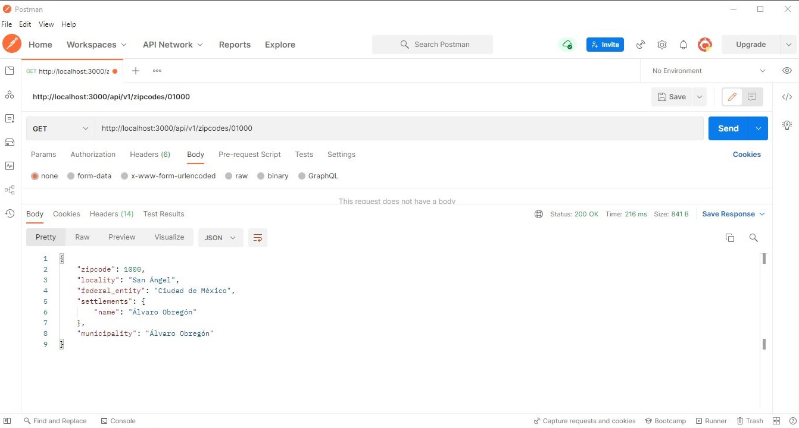

# CODIGOS POSTALES DE MEXICO

Esta es una api básica para consultar **códigos postales de México** desde **Rails**.

**Puntos a considerar:**

1. La base de datos está implementada en SQLite para simplicidada de la información.
   * Tabla: zipcodes
   * Campos: zipcode. locality, federal_entity y municipality
2. Se implementaron los métodos CRUD para los códigos postales aunque realmente no es necesario cambiar nada.
3. Esta es una lista de códigos postales de México actualizada a marzo de 2022.
4. La carga de la lista de códigos postales está implementada en "feed". Para poder ejecutarlo ingresa el comando: rails db:feed
   * Archivo ubicado en: db/feed.rb
5. Por cuestión de "buenas prácticas" se mostrará la ruta con el prefijo "api/v1".
6. Para ejecutar sólo hay que instalar dependencias y activar el servidor Rails:
   * bundle install
   * rails s

Rutas:

Listado  de códigos postales (limitado a 20 registros aleatorios):

```
http://localhost:3000/api/v1/zipcodes
```

Buscar información de un código postal en específico:

```
http://localhost:3000/api/v1/zipcodes/{zip-code}
```

***Nota:** arrojará un error si el código postal no existe registrado.*

Ejemplos de captura:


